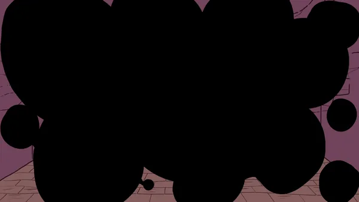
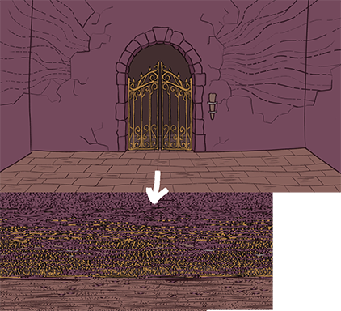

**Hermit** is a proof of concept block compression based on Colt McAnlis's [Crabby](https://github.com/mainroach/crabby).

## What it is

- Can help to reduce install size, RAM and VRAM usage for 2D art-heavy games. Depends heavily on the art style (more on this below).
- Principle: for every animation or a static image, go through every block of 4x4 pixels and find duplicates. We only store unique blocks of 4x4 pixels and convert the frames to indices into that pallette. We then decode it on the GPU using a simple shader. Very GPU-compression friendly. Block compression on top of block compression, we gotta go deeper.
- This is a **proof of concept** and not ready to use as-is. I tried making it as obvious and user-friendly as a proof-of-concept can be, but expect  rough edges. Make sure to also check the `offscreen-decoder-approach` git tag for an alternative decoder version (more on this below).
- This is *deliberately* developed and tested on Godot 4.4.1 with a `Compatibility` rendering method for the reasons described below. Version 4.6 brings integer texture format support that will allow to simplify the decoding shader a lot, keep that in mind if you consider using `hermit` or adjusting it for your project.

Here's how the palette scrambling works in a nutshell. For the animations - it shares the same palette for all of the frames.

## Results

I spent a few evenings to make some test art in Toonsquid and Photoshop. Which reminds me - **the art in this repo is CC-BY-4.0**.

I spent another few to write this stuff. Repo has 4 main setups to check - lossless, vram-compressed, hermit and hermit-compressed. I also include an alternative off-screen decoder data which is available to test locally by rolling back to the `offscreen-decoder-approach` git tag. `Baseline` is an empty scene and empty project. This is the lowest you can get for a Godot 4.4.1 project.

| Variant | .pck size | VRAM textures | VRAM total | RAM |
|---|---|---|---|---|
| Baseline | 14 KB | 14.10 MiB | 22.24 MiB | 24.06 MiB |
| Lossless | 1 212 KB | 210.1 MiB | 218.2 MiB | 24.19 MiB |
| Vram compressed | 36 670 KB | 61.81 MiB | 69.95 MiB | 24.21 MiB |
| hermit lossless | 1 347 KB | 21.03 MiB | 29.17 MiB | 31.51 MiB |
| hermit vram compressed DXT | 660 KB | 16.04 MiB | 24.18 MiB | 30.61 MiB |
| hermit offscreen decode | 1 348 KB | 52.66 MiB | 66.89 MiB | 31.60 MiB |
| hermit offscreen decode + compressed | 661 KB | 47.66 MiB | 59.86 MiB | 30.69 MiB |

- Hermit and Hermit Offscreen Decode - the second option uses an offscreen SubViewframe to temporarily render the frames and the art. It has a flat cost of a full RG8 / RGBA8 uncompressed per shown sprite. It supports bilinear filtering and all of the regular sprite stuff that Godot offers. It's not an advised option for mobile devices because of the tile-based architecture (offscreen rendering will incur a full resolve on each re-draw).
- Check the `harness/harness.gd` script to see how to run these tests and get your own results.
- Check with your own art and scenes. Hermit won't help much of your art has a lot of gradients or unique parts.

## What got me writing it

I've known about Crabby for a long time and always had it at the back of my mind. But one of the [recent Reddit posts](https://www.reddit.com/r/godot/comments/1wsrbk4/godot_44_my_2d_card_game_is_already_7_gb_export/) in Godot community made me finally take a close look into it.

The problem described in the post is mostly about export size being too large - 7GB for a 2D card game. Even with the asset duplication aside (another problem described in the post), it's still around 3.5GB of data. Not to mention the amount of VRAM the game can consume at any given point. The post has art examples that made me remember the [old McAnlis's talk](https://www.youtube.com/watch?v=jHXzzHElFPk) on texture compression where he also talked about Crabby.

His examples match closely to the animation art of the game from that Reddit post - lot's of similar pixels between frames, etc. The art style also fits this nicely - lot's of flat areas without gradients and no filtering.

His numbers showed that it's possible to get something like 85% of lossless compression for RAM / VRAM and possibly reduce the install size too (depending on whether the game assets are saved as WebP / PNG or vram-compressed)

## How to run locally

- Godot 4.4.1
- Compatibility renderer. Other renderers should work, but not tested
- PC with a GPU that supports DXT and BC7 (basically any DX11-capable GPU). Should work on Linux / Mac too, but not tested

## Installing

- Copy addons/hermit into your project
- Enable the plugin in Project Settings
- Probably reload the project or something

## Usage

### Creating a flipbook

- Right-click a folder of PNG frames, "Create Hermit Flipbook"
- The importer creates a `.hermit` file in the same folder, as your animation folder. Do not move it anywhere else as it has a relative path to the original frames stored. It's a simple JSON manifest that you can manually edit (this is how it initially worked, but was not very user-friendly). **Only PNGs** are supported, but it's easy to adjust the source to also include other formats.
- Static frames are not supported as static frames, you still have to create an animation. The project example uses a folder for the `bg.png` image and a one-frame animation.

### Import options

fps, loop, palette format (Lossless / DXT / BC7). Don't forget to press Reimport after changing.

### Playing it

- Adding a HermitSprite2D using your regular Add Child Node process (Ctrl + A) and assigng the flipbook asset.
- It has exposed properties: Flipbook Frame, Playing, Speed Scale. Speed Scale doesn't work with values < 0. To play backwards, see below.
- API methods: play, play_backwards, pause, stop, is_playing
- API signals: animation_finished, animation_looped, flipbook_frame_changed. See code examples in the scenes.

## Limitations

- Encoder is written in GDScript and is VERY slow on large animations. It's here just because it's easier to integrate. Ideally, you want to have a standalone encoder written in something faster.
- When using an offscreen decoder, every playing sprite needs its own full-size render target.
- When using "Export selected scenes" needs *.gdshader added to the include filter, otherwise it fails to work.
- DXT and BC7 palettes are lossy
- Source frames are still imported as textures unless excluded. There's code to automatically ignore the frames folder and remove the .import settings files for them. You can find and uncomment the code to get this behavior

## Credits

- Crabby by Colt McAnlis: https://github.com/mainroach/crabby
- the GDC 2014 talk: https://www.youtube.com/watch?v=jHXzzHElFPk

## License

- Code: MIT, see LICENSE.md
- Art in this project: CC BY 4.0. Please link this project's page if you plan on using it somewhere
